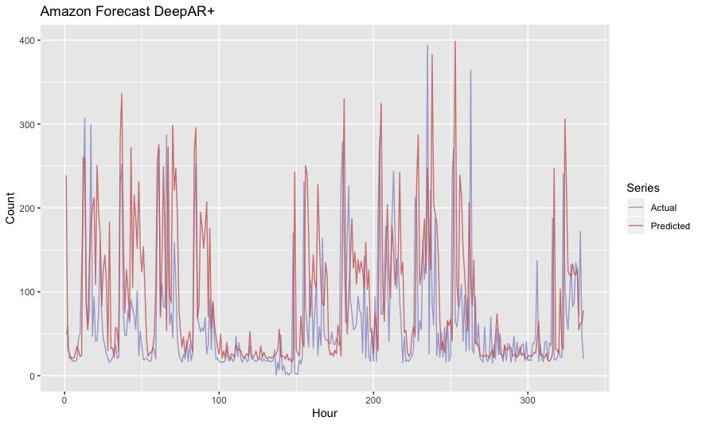
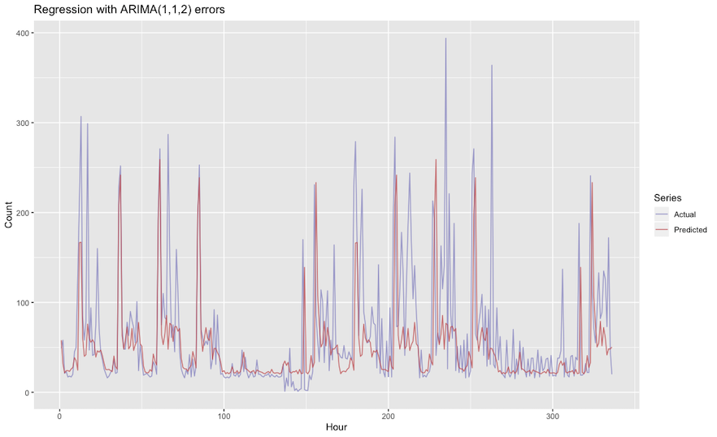

Who's Using Amazon Forecast?
==============================

.. post:: Nov 05, 2019
   :tags:
   :category:

Nov 05, 2019

Six years ago the fist release of `Amazonica <https://github.com/mcohen01/amazonica>`_ had support for something like 80% or 90% of the public api. Back then there were only maybe a handful of services that no one really used, now there seems to be all kinds of stuff I've never touched nor likely will. Greengrass? Groundstation? Never heard of 'em. Managed Blockchain? Apparently `it's a thing. <https://aws.amazon.com/managed-blockchain/>`_ A very crude indicator of how much demand there is for a new Amazon service is how quickly, if ever, a PR shows up adding support. (Amazonica is a Clojure client for AWS that just invokes the official Java SDK, so as soon as the service shows up in the Java SDK it takes like `4 lines <https://github.com/mcohen01/amazonica/pull/416/files>`_ of `copy pasta <https://github.com/mcohen01/amazonica/pull/382/files>`_ to add it to Amazonica.) Forecast has been available for `close to a year <https://aws.amazon.com/blogs/aws/amazon-forecast-time-series-forecasting-made-easy/>`_ and no one in the (admittedly small) Clojure community has had need for it thus far.

Making your data available to Forecast is not too onerous, other than the fact that the ``item_id`` column is required even in the simplest case where you in fact have no associated dimensions, just a univariate time series. In such cases you just have to populate the column with the same value. The only thing else worth mentioning is that if you point Forecast at an S3 bucket your datasets need to be suffixed with .csv for Forecast to pick them up.

.. highlight:: clojure
.. code:: clojure

  (require '[amazonica.aws.forecast :as fc])

  (fc/create-dataset :dataset-name "hourly_ts"
                     :data-frequency "H"
                     :dataset-type "TARGET_TIME_SERIES"
                     :domain "CUSTOM"
                     :schema {
                       :attributes [
                         {
                           :attribute-name "timestamp"
                           :attribute-type "timestamp"
                         },
                         {
                           :attribute-name "target_value"
                           :attribute-type "float"
                         },
                         {
                           :attribute-name "item_id"
                           :attribute-type "string"
                         }]})

  (fc/create-dataset-group :dataset-arns ["arn:aws:forecast:us-east-1:123456789012:dataset/hourly_ts"]
                           :dataset-group-name "hourly_ts"
                           :domain "CUSTOM")

  (fc/create-dataset-import-job :dataset-import-job-name "import_hourly_ts_job"
                                :dataset-arn "arn:aws:forecast:us-east-1:123456789012:dataset/hourly_ts"
                                :data-source {
                                  :s3-config {
                                    :path "s3://amazonica-forecast/hourly_ts.csv"
                                    :role-arn "arn:aws:iam::123456789012:role/amazonica"}})

|

The `hourly_ts.csv <https://gist.github.com/mcohen01/0b656c7b7accdb704de69f3596971ce9>`_ looks something like:

|

.. csv-table::
   :header: "ds", "y", "item_id"
   :url: https://gist.githubusercontent.com/mcohen01/35092e2952af19baf858995c3d0a948d/raw/9531dd8ba549b1f61b5a90d2e467f074daf23599/hourly_ts_head.csv

|
|

This is hourly count data of resource utilization in AWS. Plotting the full dataset suggests at least one seasonal component. 

Plotting a one month subset of the data as well as a two week subset gives a clearer picture.

.. image:: ./_images/hourly_ts_one_month.png

.. image:: ./_images/hourly_ts_two_weeks.png

The graphs suggest a daily and weekly cycle are present. Plots of all weekdays and all weekend days provide further evidence.

.. image:: ./_images/hourly_ts_weekends.png

Time series data often contain multiple seasonal components which can make forecasting challenging. If the process producing the data is somehow tied to human activity the time series will often exhibit multiple cycles, such as the daily and weekly cycles we see above. Amazon Forecast offers several different algorithms for analysing time series data, including the familiar ETS and ARIMA models, as well as `Prophet's GAM <https://facebook.github.io/prophet/>`_ and Amazon's own `RNN implementation <https://docs.aws.amazon.com/forecast/latest/dg/aws-forecast-recipe-deeparplus.html>`_.

Unfortunately, Amazon Forecast's ARIMA interface doesn't expose the same set of knobs you can fiddle with when you're working directly in R. We specified hourly frequency of the time series, **as there does not appear to be any way to specify multiple seasonal periods in Amazon Forecast.**  

.. highlight:: clojure
.. code:: clojure

  (fc/create-predictor :input-data-config {
                         :dataset-group-arn "arn:aws:forecast:us-east-1:123456789012:dataset-group/hourly_ts"}
                       :algorithm-arn "arn:aws:forecast:::algorithm/ARIMA"
                       :forecast-horizon 336
                       :featurization-config {
                         :forecast-frequency "H"}
                       :predictor-name "hourly_ts_predictor")

|

Creating the predictor took quite a long time, at least 10 or 15 minutes. Unfortunately, we see a single, daily periodicity in the forecast predictions from this inadequate model. `Mean Absolute Scaled Error <https://robjhyndman.com/papers/foresight.pdf>`_ was 1.73 (lower is better). MAPE was 4.17.

|

.. image:: ./_images/forecast_arima.png

|

Amazon's DeepAR+ algorithm is specifically designed to handle forecasts such as those that can be found in supply chain management, where multiple related time series exist and can be treated something like covariates. Prophet approaches the problem by ignoring the temporal aspect of time series data altogether:

  We are, in effect, framing the forecasting problem as a curve-fitting exercise, which is inherently different from time series models that explicitly account for the temporal dependence structure in the data. While we give up some important inferential advantages of using a generative model such as an ARIMA, this formulation provides a number of practical advantages. - `Taylor & Letham 2017 <https://peerj.com/preprints/3190.pdf>`_

Amazon Forecast has an AutoML option when you create a predictor that simply tries every algorithm they support and chooses the best one. Though unfortunately it does take quite some time to execute. The automl predictor took something like two hours to compute. DeepAR+ apparently performed best on this dataset. MASE was 1.18. MAPE was 1.64.

|

In the R community, the `forecast <http://pkg.robjhyndman.com/forecast/>`_ package (though technically superceded by ``fable``) has long been the goto package for time series analysis, particularly for its `auto.arima() <http://pkg.robjhyndman.com/forecast/reference/auto.arima.html>`_ function. Hyndman's book has a `couple <https://otexts.com/fpp2/dhr.html>`_ of `good sections <https://otexts.com/fpp2/complexseasonality.html>`_ on using dynamic harmonic regression to model time series with multiple seasonal components. The model with Fourier terms and R code would look something like the following.

.. math::

   \begin{align}
   y_t = \beta_0 + \beta x_t + \sum_{k=1}^K[\alpha_k s_k(t) + \gamma_k c_k(t)] + e_t
   \end{align}

.. highlight:: r
.. code:: r

  order <- c(12, 12)
  arima.model <- auto.arima(train,
                            seasonal = F,
                            lambda = 0,
                            allowdrift = T,
                            allowmean = T,
                            xreg = fourier(train, K = order))
  arima.fc <- forecast(arima.model, xreg = fourier(train, K = order, h = 24*7*2))

Here we specify a two element vector as ``K``, generating 24 Fourier terms (12 sin and cosine terms) to model the two seasonal components, as opposed to a scalar, which is what the `Amazon Forecast docs <https://docs.aws.amazon.com/forecast/latest/dg/aws-forecast-recipe-arima.html>`_ seem to suggest is what you get when you choose their ARIMA algorithm. (It's unclear to me if they're literally invoking R and the ``forecast`` package behind the scenes.) ``auto.arima()`` also gives you back the upper and lower bounds for the 80 and 95 percentiles, which is quite handy to get an idea of the uncertainty in the forecast. (The plot below links to a larger image with the 95% bounds shown.) MASE was .73. MAPE was .89.

So, at least for time series data with multiple seasonal components, the forecast package's ``auto.arima()`` clearly yields the best performing model compared against Amazon Forecast's available algorithms. Given how long it takes to create predictors and forecasts using the AWS service, I really do wonder who exactly is using Forecast and for what use case.

