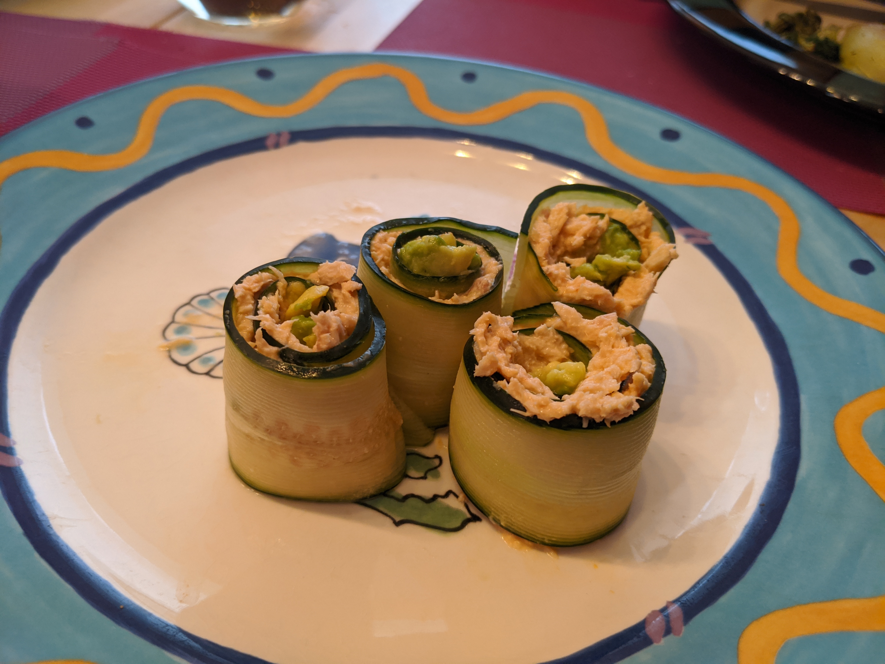

What We Did During The Thing
==============================

.. post:: Apr 22, 2020
   :tags:
   :category:

_

So I'll start off going backwards from today and show you the photos I have on
my phone going back to the beginning of all this. (You can click on any of them to
enlarge.) I stopped going to my gym
a couple of days after I stopped going in to work, which was Tuesday, March 10.
So I had to find another place to run instead of the treadmill. I can't really run
on concrete anymore, too much pounding, but the rubber belt on the treadmill offered
enough cushion. The only replacement I've found is on the astroturf of the football field
just inside the track at the high school down the street. It's a pretty nice field. I
go three or four times a week, sometime between 7 and 9am, hop the fence, and get 3 or 4 miles
in. They have cameras that I guess can see where I get over the fence, and a couple of weeks
ago they had put grease on the top of the fence where you grab to pull yourself over. The next
day I brought paper towels with me. A couple of days later there was that yellow "Caution" tape
across the fence. There's been no further brinksmanship though, I've been over the tape 5 or 6 times.
I figure at some point Pacifica PD will tell me, "You can't do that anymore, _sshole." Until then,
this is my morning ritual, after I walk the dogs of course.

.. image:: ./_images/quarantine/terra_nova_tigers.jpg
    :target: ../_images/terra_nova_tigers.jpg

|

This last Sunday Maxine got the garden ready after the winter and planted a bunch of veggies, and we got our
first rose of the season.

.. image:: ./_images/quarantine/garden.jpg
    :target: ../_images/garden.jpg

|

|

Albacore tuna with a little Sriracha wrapped in cucumber and with a little avocado inside. Maxine saw
this somewhere and made it. Date of the photo says she discovered this April 17. We affectionately
call it redneck sushi. My friend Joel goes surfing 4 or 5 times a week, mostly driving 90 minutes down
to Santa Cruz for the best surfing in NorCal. He flat out refuses to surf in Pacifica, because the waves
just aren't very big here, but he jokingly explains why, "Mike, they're rednecks." That was part of the
attraction for Maxine and I.

|

A couple of weeks ago, Saturday April 11, we went for a hike in the hills around the house. I marked the
house in red on the map below and the high school from the first photo on this page in blue. We walked north
from the house towards the high school and then up the hill. About 1000 feet or so you get to the top, where
there's a ridge you can walk along, head east for a bit and then south, and then west back towards the house.
The whole loop took us about 3 hours.

|

This is once you've climbed up the hill most of the way, looking west, towards the ocean.

.. image:: ./_images/quarantine/san_pedro_point.jpg
   :target: ../_images/san_pedro_point.jpg

|

This is looking south back towards the neighborhood. You can
just barely see the high school track and football field and the baseball diamond in the bottom right quadrant.
Our house is in the dead center of the photo, where you see those houses on top of the mound. We're actually out
of sight, a bit beyond that, down the mound a bit, not exactly right on the top of it.

.. image:: ./_images/quarantine/mountains_south.jpg
    :target: ../_images/mountains_south.jpg

|

This next shot is looking east. You walk along the ridge on the far left side of this photo, and then
across the photo to the right, and come back down the hill to get back to the house from the east.

.. image:: ./_images/quarantine/mountains_southeast.jpg
    :target: ../_images/mountains_southeast.jpg

|

This last one is looking due east. It's actually the start of the middle of the hike, just after you climbed
up the hill to get to the ridge.

.. image:: ./_images/quarantine/mountains_east.jpg
    :target: ../_images/mountains_east.jpg

|

When we got home we made some gambas al ajillo! We get a bag of frozen shrimp for like $15, throw them in some
olive oil and sherry, garlic, and red pepper flakes. The key is the olive oil. Last trip to Spain we discovered
`Picual olive oil <https://oliveoillovers.com/oro-bailen-reserva-familiar-picual/>`_. It's worth the extra money.

.. image:: ./_images/quarantine/gambas.jpg
    :target: ../_images/gambas.jpg

|

March 31. Kids in the neighborhood have been home for a couple weeks by then I think and are getting bored.

.. image:: ./_images/quarantine/sidewalk_art_1.jpg
|
.. image:: ./_images/quarantine/sidewalk_art_2.jpg
|

March 27, the goats arrived! I went for my morning run and as I was walking back to the house I see all these
goats on the small hillside back behind our house. The neighbor said PG&E hires them to come cut the grass every
year around this time. You can't really get back there with equipment, but the goats tore it up! They were there
for about 5 days. The ranch hand parked his trailer on the street and would move them further along the hillside
every day. At the top of this photo you can see our next door neighbor's backyard deck edging up to the downslope.
Our house is the next one to the right.

.. image:: ./_images/quarantine/goats.jpg
    :target: ../_images/goats.jpg

|

We filmed this off the end of the back deck the day they had fenced them in right behind our house. Oliver was
excited.

.. raw:: html

    
    <video src="../_images/goats.mp4" controls></video>

|

March 20. We made in eggs in purgatory for breakfast. Heat up jar of Mia's arrabiata sauce and throw some eggs in!
It's almost as good as pasta for breakfast.

.. image:: ./_images/quarantine/eggs_in_purgatory.jpg
    :target: ../_images/eggs_in_purgatory.jpg

|

The jasmine bushes in back were really starting to come in at this point...

|

That afternoon a friend came over and we rode the mountain bikes over to Mori Point, which is only a few miles away
north towards the old house. The first photo is looking south. This was the first day since before winter that I had
seen the weather and water looking so clear.

.. image:: ./_images/quarantine/mori_point_1.jpg
    :target: ../_images/mori_point_1.jpg

|

This one is looking north. The old house is in the neighborhood on the far middle right edge of the photo. We used to
walk the beach with the dogs once a month or so. It's their favorite thing.

.. image:: ./_images/quarantine/mori_point_3.jpg
    :target: ../_images/mori_point_3.jpg

|

March 19. Nice sunset

.. image:: ./_images/quarantine/sunset_3.jpg
    :target: ../_images/sunset_3.jpg

|

March 10. This sunset was even better. I don't think we've got one as good since then, but it's still early...

.. image:: ./_images/quarantine/sunset_1.jpg
    :target: ../_images/sunset_1.jpg

|

.. image:: ./_images/quarantine/sunset_2.jpg
    :target: ../_images/sunset_2.jpg

|